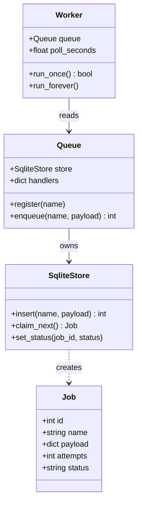

# Class Diagram

## Core Types

```mermaid
classDiagram
    class Job {
        +int id
        +string name
        +dict payload
        +int attempts
        +string status
    }
    class Queue {
        +SqliteStore store
        +dict handlers
        +register(name)
        +enqueue(name, payload) int
    }
    class Worker {
        +Queue queue
        +float poll_seconds
        +run_once() bool
        +run_forever()
    }
    class SqliteStore {
        +insert(name, payload) int
        +claim_next() Job
        +set_status(job_id, status)
    }
    Queue --> SqliteStore : owns
    Worker --> Queue : reads
    SqliteStore ..> Job : creates
```

## Notes

The store holds one sqlite3 connection; none of these classes are safe to share across threads.
